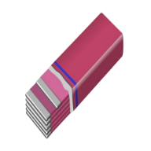

# GUMS: Graph User Management System


## Introduction
This project is a spring application that provides a reactive REST API for managing users and projects linked to them.
The application stores data in the NoSQL MongoDB.

## Details
The application is meant to be a toy project that plays with spring, in particular, the project uses:
- Spring IoC
- Spring Data
- Spring AOP
- Spring webMVC
- Spring Security
- JUnit 5
- Mockito
- Cucumber
- MongoDB
- Lombok
- H2

In the frontend it uses:
- Angular
- Three.js
- Jest

Building/CI:
- Maven
- Docker
- Docker compose
- Github action

The choice of not using spring boot is intentional, the goal is to understand how spring works under the hood.

## Run the fullstack application
In order to run the application you need to have docker installed and then run the following command
from the root directory of the project:
```bash
docker compose up
```
it will:
- pull the mongo image
- build and start the backend application, exposed on port 8080
- build and start the frontend application, exposed on port 32769

Then you can open your browser at
http://localhost:32769

## TODO
- fix UI bug on dialog opening
- add links in the graph
- ensure project names are unique in backend